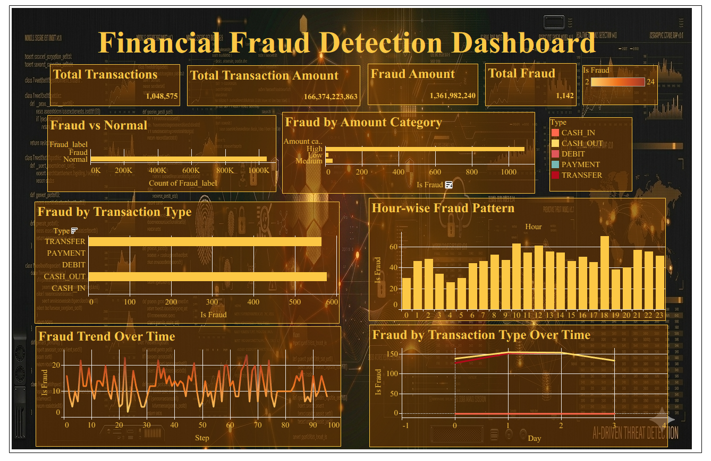
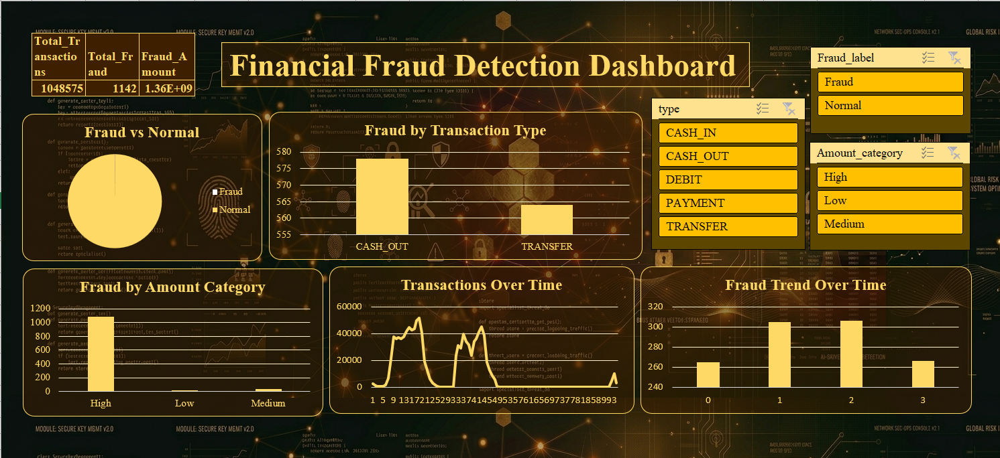

<h1> Financial Fraud Detection Analysis Dashboard</h1>
An interactive data analytics project using Excel and Tableau to identify fraud patterns and generate actionable insights.

<h2> Project Overview</h2>

The <b>Financial Fraud Detection Analysis Dashboard</b> is an end-to-end data analytics project designed to identify fraudulent transactions, uncover hidden patterns, and support decision-making for fraud prevention.

This project leverages <b>data visualization techniques</b> to transform raw transaction data into meaningful insights using <b>Microsoft Excel and Tableau</b>.

<h2> Problem Statement</h2>

Financial institutions face significant losses due to fraudulent transactions. The objective of this project is to:

<ul>
  <li>Detect anomalies in transaction behavior</li>
  <li>Identify high-risk transaction types and categories</li>
  <li>Analyze fraud trends over time</li>
  <li>Provide actionable insights to reduce fraud risk</li>
</ul>

<h2> Tools & Technologies</h2>
<ul>
  <li><b>Microsoft Excel</b>
    <ul>
      <li>Data Cleaning & Transformation</li>
      <li>KPI Calculation</li>
      <li>Dashboard Creation</li>
    </ul>
  </li>
  <li><b>Tableau</b>
    <ul>
      <li>Interactive Dashboards</li>
      <li>Advanced Visual Analytics</li>
    </ul>
  </li>
  <li><b>Dataset</b>
    <ul>
      <li>Synthetic Financial Transaction Dataset</li>
    </ul>
  </li>
</ul>

<h2> Dataset Description</h2>

<table border="1" cellpadding="8" cellspacing="0">
  <tr>
    <th>Column Name</th>
    <th>Description</th>
  </tr>
  <tr><td>step</td><td>Time step (hourly data)</td></tr>
  <tr><td>type</td><td>Transaction type (CASH_IN, CASH_OUT, TRANSFER, etc.)</td></tr>
  <tr><td>amount</td><td>Transaction amount</td></tr>
  <tr><td>nameOrig</td><td>Sender</td></tr>
  <tr><td>oldbalanceOrg</td><td>Sender balance before transaction</td></tr>
  <tr><td>newbalanceOrig</td><td>Sender balance after transaction</td></tr>
  <tr><td>nameDest</td><td>Receiver</td></tr>
  <tr><td>oldbalanceDest</td><td>Receiver balance before transaction</td></tr>
  <tr><td>newbalanceDest</td><td>Receiver balance after transaction</td></tr>
  <tr><td>isFraud</td><td>Fraud indicator (1 = Fraud, 0 = Normal)</td></tr>
  <tr><td>isFlaggedFraud</td><td>Flagged fraudulent transactions</td></tr>
</table>

<h2> Data Preparation</h2>
<ul>
  <li>Cleaned and validated transaction data</li>
  <li>Created calculated fields:
    <ul>
      <li>Fraud Rate (%)</li>
      <li>Fraud Amount</li>
      <li>Amount Category (Low, Medium, High)</li>
      <li>Hour extraction from step</li>
    </ul>
  </li>
  <li>Removed inconsistencies and ensured data accuracy</li>
</ul>

<h2> Dashboard Preview</h2>

<h3>Tableau Dashboard</h3>

<h3>Excel Dashboard</h3>

<h2> Dashboard Features</h2>

<h3> KPI Metrics</h3>
<ul>
  <li>Total Transactions</li>
  <li>Total Transaction Amount</li>
  <li>Total Fraud Cases</li>
  <li>Fraud Amount</li>
  <li>Fraud Rate (%)</li>
  <li>Average Fraud Transaction Amount</li>
</ul>

<h3> Key Visualizations</h3>
<ol>
  <li>Fraud vs Normal Transactions</li>
  <li>Fraud by Transaction Type</li>
  <li>Fraud by Amount Category</li>
  <li>Fraud Trend Over Time</li>
  <li>Hour-wise Fraud Pattern</li>
  <li>Fraud by Transaction Type Over Time</li>
</ol>

<h2> Key Insights</h2>
<ul>
  <li><b>CASH_OUT and TRANSFER transactions</b> show the highest fraud occurrences</li>
  <li>Fraud is significantly higher in <b>high-value transactions</b></li>
  <li>Fraud patterns fluctuate over time, indicating potential targeted activities</li>
  <li>Specific hours exhibit higher fraud activity</li>
</ul>

<h2> Business Recommendations</h2>
<ul>
  <li>Implement stricter validation for <b>high-value transactions</b></li>
  <li>Enhance monitoring for <b>TRANSFER and CASH_OUT transactions</b></li>
  <li>Introduce <b>real-time fraud detection systems</b></li>
  <li>Use <b>time-based monitoring</b> during peak fraud hours</li>
  <li>Improve fraud detection models using behavioral analytics</li>
</ul>

<h2> Repository Structure </h2>

<pre>
Financial-Fraud-Detection-Dashboard
│
├── Excel Dashboard
├── Tableau Dashboard
├── images
│   ├── excel_dashboard.png
│   └── tableau_dashboard.png
└── README.md
</pre>

Note: The dataset is embedded within the Excel and Tableau files.

<h2> Conclusion</h2>

This project demonstrates how data analytics and visualization can be effectively used to detect fraudulent activities, uncover hidden patterns, and support proactive decision-making in financial systems.

<h2> Author</h2>

<b>Anjana C</b>

<ul>
  <li>Aspiring Business Analyst</li>
  <li>Skilled in PowerBI, Excel, Tableau, SQL, and Python</li>
</ul>
